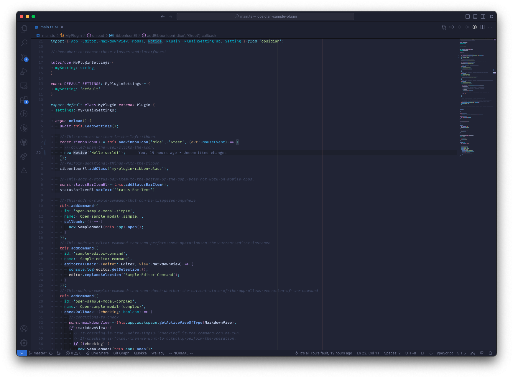

# Tokyo Night Moon

A dark theme for [Visual Studio Code](https://code.visualstudio.com/). A port on the "moon" variant of the [Tokyo Night NeoVim Theme by Folke](https://github.com/folke/tokyonight.nvim), which in turn was inspired by the [Tokyo Night VSCode Theme by enkia](https://github.com/enkia/tokyo-night-vscode-theme). I love this theme in NeoVim and was always very sad that it wasn't available in VSCode. So I ported it myself.

## Screenshot

